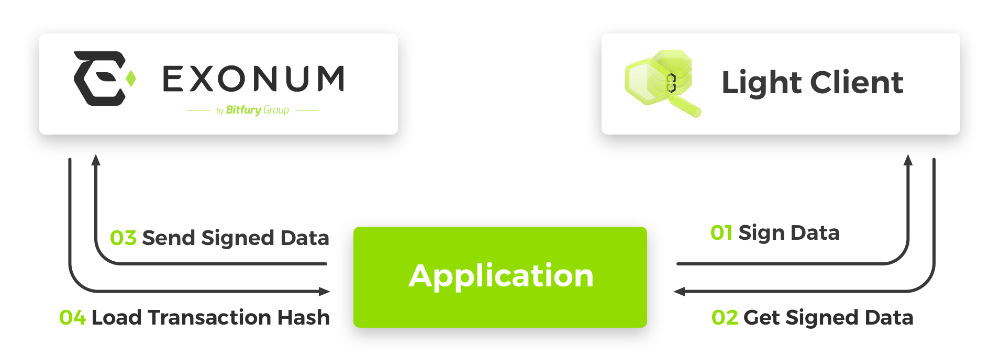
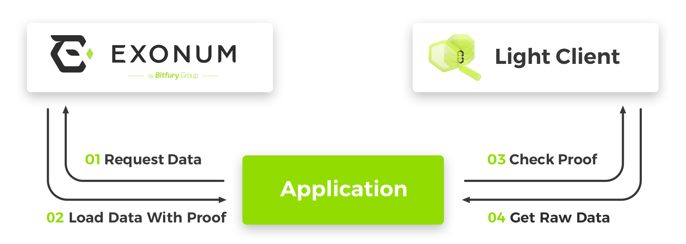
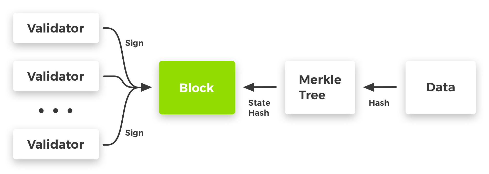

# Light Client for Exonum Blockchain

[![Build status][travis-image]][travis-url]
[![npm version][npmjs-image]][npmjs-url]
[![Coverage Status][coveralls-image]][coveralls-url]
[![js-standard-style][codestyle-image]][codestyle-url]

[travis-image]: https://img.shields.io/travis/exonum/exonum-client/master.svg
[travis-url]: https://travis-ci.org/exonum/exonum-client
[npmjs-image]: https://img.shields.io/npm/v/exonum-client.svg
[npmjs-url]: https://www.npmjs.com/package/exonum-client
[coveralls-image]: https://coveralls.io/repos/github/exonum/exonum-client/badge.svg?branch=master
[coveralls-url]: https://coveralls.io/github/exonum/exonum-client?branch=master
[codestyle-image]: https://img.shields.io/badge/code%20style-standard-brightgreen.svg
[codestyle-url]: http://standardjs.com 

A JavaScript library to work with Exonum blockchain from browser and Node.js.
Used to sign transactions before sending to blockchain and verify blockchain responses using cryptographic proofs.
Contains numerous helper functions.

*Find out more information about the [architecture and tasks][docs:clients] of light clients in Exonum.*

* [Getting started](#getting-started)
* [Data types](#data-types)
  * [Define data type](#define-data-type)
  * [Built-in types](#built-in-types)
  * [Nested data types](#nested-data-types)
  * [Arrays](#arrays)
* [Serialization](#serialization)
* [Hash](#hash)
* [Signature](#signature)
  * [Sign data](#sign-data)
  * [Verify signature](#verify-signature)
* [Transactions](#transactions)
  * [Define transaction](#define-transaction)
  * [Serialize transaction](#serialize-transaction)
  * [Sign transaction](#sign-transaction)
  * [Verify signed transaction](#verify-signed-transaction)
  * [Get a transaction hash](#get-a-transaction-hash)
* [Cryptographic proofs](#cryptographic-proofs)
  * [Merkle tree](#merkle-tree)
  * [Merkle Patricia tree](#merkle-patricia-tree)
* [Integrity checks](#integrity-checks)
  * [Verify block](#verify-block)
  * [An example of checking the existence of data](#an-example-of-checking-the-existence-of-data)
* [Helpers](#helpers)
  * [Generate key pair](#generate-key-pair)
  * [Get random number](#get-random-number)
  * [Converters](#converters)
    * [Hexadecimal to Uint8Array](#hexadecimal-to-uint8array)
    * [Hexadecimal to String](#hexadecimal-to-string)
    * [Uint8Array to Hexadecimal](#uint8array-to-hexadecimal)
    * [Binary String to Uint8Array](#binary-string-to-uint8array)
    * [Binary String to Hexadecimal](#binary-string-to-hexadecimal)
    * [String to Uint8Array](#string-to-uint8array)
* [Contributing](#contributing)
  * [Coding standards](#coding-standards)
  * [Test coverage](#test-coverage)
* [License](#license)

## Getting started

There are several options to include light client library in the application:

The most preferred way is to install Exonum Client as a [package][npmjs] from npm registry:

```sh
npm install exonum-client
```

Otherwise you can download the source code from GitHub and compile it before use in browser.

Include in browser:

```html
<script src="node_modules/exonum-client/dist/exonum-client.min.js"></script>
```

Usage in Node.js:

```javascript
var Exonum = require('exonum-client');
```

## Data types

The definition of data structures is the main part of each application based on Exonum blockchain.

On the one hand, each transaction must be [signed](#sign-data) before sending into blockchain.
Before the transaction is signed it is converted into byte array under the hood.

On the other hand, the data received from the blockchain should be converted into byte array under the hood
before it will be possible to [verify proof of its existence](#cryptographic-proofs) using cryptographic algorithm.

Converting data into a byte array is called [serialization](#serialization).
To get the same serialization result on the client and on the [service][docs:architecture:services] side,
there must be a strict serialization rules. This rules are formed by the data structure definition.

### Define data type

```javascript
var type = Exonum.newType({
  size: 12,
  fields: {
    balance: {type: Exonum.Uint32, size: 4, from: 0, to: 4},
    name: {type: Exonum.String, size: 8, from: 4, to: 12}
  }
});
```

**Exonum.newType** function requires a single argument of `Object` type with next structure:

| Property | Description | Type |
|---|---|---|
| **size** | The total length in bytes. | `Number` |
| **fields** | List of fields. | `Object` |

Field structure:

| Field | Description | Type |
|---|---|---|
| **type** | Definition of the field type. | [Built-in type](#built-in-types), [array](#arrays) or [custom data type](#nested-data-types) defined by the developer. | 
| **size** | Total length of the field in bytes. | `Number` |
| **from** | The beginning of the field segment in the byte array. | `Number` |
| **to** | The end of the field segment in the byte array. | `Number` |

### Built-in types

There are several primitive types are built it into the library.
These types must be used when constructing custom data types.

| Name | Size | Description | Type |
|---|---|---|---|
| **Int8** | 1 | Number in a range from `-128` to `127`. | `Number` |
| **Int16** | 2 | Number in a range from `-32768` to `32767`. | `Number` |
| **Int32** | 4 | Number in a range from `-2147483648` to `2147483647`. | `Number` |
| **Int64** | 8 | Number in a range from `-9223372036854775808` to `9223372036854775807`. | `Number` or `String`\* |
| **Uint8** | 1 | Number in a range from `0` to `255`. | `Number` |
| **Uint16** | 2 | Number in a range from `0` to `65535`. | `Number` |
| **Uint32** | 4 | Number in a range from `0` to `4294967295`. | `Number` |
| **Uint64** | 8 | Number in a range from `0` to `18446744073709551615`. | `Number` or `String`\* |
| **String** | 8\*\* | A string of variable length consisting of UTF-8 characters. | `String` |
| **Hash** | 32 | Hexadecimal string. | `String` |
| **PublicKey** | 32 | Hexadecimal string. | `String` |
| **Digest** | 64 | Hexadecimal string. | `String` |
| **Bool** | 1 | Value of boolean type. | `Boolean` |

*\*JavaScript limits minimum and maximum integer number.
Minimum safe integer in JavaScript is `-(2^53-1)` which is equal to `-9007199254740991`.
Maximum safe integer in JavaScript is `2^53-1` which is equal to `9007199254740991`.
For unsafe numbers out of the safe range use `String` only.
To determine either number is safe use built-in JavaScript function
[Number.isSafeInteger()][is-safe-integer].*

*\*\*Size of 8 bytes is due to the specifics of string [serialization][docs:architecture:serialization:segment-pointers]
using segment pointers.
Actual string length is limited only by the general message size limits which is depends on OS, browser and
hardware configuration.*

### Nested data types

Custom data type defined by the developer can be a field of other custom data type.

A nested type, regardless of its real size, always takes **8 bytes** in the parent type due to the specifics of its
[serialization][docs:architecture:serialization:segment-pointers] using segment pointers.

An example of a nested type:

```javascript
// Define a nested data type
var date = Exonum.newType({
  size: 4,
  fields: {
    day: {type: Exonum.Uint8, size: 1, from: 0, to: 1},
    month: {type: Exonum.Uint8, size: 1, from: 1, to: 2},
    year: {type: Exonum.Uint16, size: 2, from: 2, to: 4}
  }
});

// Define a data type
var payment = Exonum.newType({
  size: 16,
  fields: {
    date: {type: date, size: 8, from: 0, to: 8},
    amount: {type: Exonum.Uint64, size: 8, from: 8, to: 16}
  }
});
```

There is no limitation on the depth of nested data types.

### Arrays

The array in the light client library corresponds to the [vector structure][vector-structure]
in the Rust language.

**Exonum.newArray** function requires a single argument of `Object` type with next structure:

| Property | Description | Type |
|---|---|---|
| **size** | Length of the nested field type. | `Number` |
| **type** | Definition of the field type. | [Built-in type](#built-in-types), array or [custom data type](#nested-data-types) defined by the developer. |

An array, regardless of its real size, always takes **8 bytes** in the parent type due to the specifics of its
[serialization][docs:architecture:serialization:segment-pointers] using segment pointers.

An example of an array type field: 

```javascript
// Define an array
var year = Exonum.newArray({
    size: 2,
    type: Exonum.Uint16
});

// Define a data type
var type = Exonum.newType({
    size: 8,
    fields: {
        years: {type: year, size: 8, from: 0, to: 8}
    }
});
```

An example of an array nested in an array:

```javascript
// Define an array
var distance = Exonum.newArray({
    size: 4,
    type: Exonum.Uint32
});

// Define an array with child elements of an array type
var distances = Exonum.newArray({
    size: 8,
    type: distance
});

// Define a data type
var type = Exonum.newType({
    size: 8,
    fields: {
        measurements: {type: distances, size: 8, from: 0, to: 8}
    }
});
```

## Serialization

Each serializable data type has its (de)serialization rules, which govern how the instances of this type are
(de)serialized from/to a binary buffer.
Check [serialization guide][docs:architecture:serialization] for details.

Signature of `serialize` function:

```javascript
type.serialize(data, cutSignature);
```

| Argument | Description | Type |
|---|---|---|
| **data** | Data to serialize. | `Object` |
| **type** | Definition of the field type. | [Custom data type](#define-data-type) or [transaction](#define-transaction). |
| **cutSignature** | This flag is relevant only for **transaction** type. Specifies whether to not include a signature into the resulting byte array. *Optional.* | `Boolean` |

An example of serialization into a byte array:

```javascript
// Define a data type
var user = Exonum.newType({
    size: 21,
    fields: {
        firstName: {type: Exonum.String, size: 8, from: 0, to: 8},
        lastName: {type: Exonum.String, size: 8, from: 8, to: 16},
        age: {type: Exonum.Uint8, size: 1, from: 16, to: 17},
        balance: {type: Exonum.Uint32, size: 4, from: 17, to: 21}
    }
});

// Data to be serialized
var data = {
    firstName: 'John',
    lastName: 'Doe',
    age: 28,
    balance: 2500
};


// Serialize
var buffer = user.serialize(data); // [21, 0, 0, 0, 4, 0, 0, 0, 25, 0, 0, 0, 3, 0, 0, 0, 28, 196, 9, 0, 0, 74, 111, 104, 110, 68, 111, 101]
```

The value of the `buffer` array:


## Hash

Exonum uses [cryptographic hashes][docs:glossary:hash] of certain data for [transactions](#transactions) and
[proofs](#cryptographic-proofs).

Different signatures of the `hash` function are possible:

```javascript
Exonum.hash(data, type);
```

```javascript
type.hash(data);
```

| Argument | Description | Type |
|---|---|---|
| **data** | Data to be processed using a hash function. | `Object` |
| **type** | Definition of the data type. | [Custom data type](#define-data-type) or [transaction](#define-transaction). |

An example of hash calculation:

```javascript
// Define a data type
var user = Exonum.newType({
    size: 21,
    fields: {
        firstName: {type: Exonum.String, size: 8, from: 0, to: 8},
        lastName: {type: Exonum.String, size: 8, from: 8, to: 16},
        age: {type: Exonum.Uint8, size: 1, from: 16, to: 17},
        balance: {type: Exonum.Uint32, size: 4, from: 17, to: 21}
    }
});

// Data that has been hashed
var data = {
    firstName: 'John',
    lastName: 'Doe',
    age: 28,
    balance: 2500
};

// Get a hash
var hash = user.hash(data); // 1e53d91704b4b6adcbea13d2f57f41cfbdee8f47225e99bb1ff25d85474185af
```

It is also possible to get a hash from byte array:

```javascript
Exonum.hash(buffer);
```

| Argument | Description | Type |
|---|---|---|
| **buffer** | Byte array. | `Array` or `Uint8Array`. |

An example of byte array hash calculation:

```javascript
var arr = [132, 0, 0, 5, 89, 64, 0, 7];

var hash = Exonum.hash(arr); // 9518aeb60d386ae4b4ecc64e1a464affc052e4c3950c58e32478c0caa9e414db
```

## Signature

The procedure for [**signing data**](#sign-data) using signing key pair
and [**verifying of obtained signature**](#verify-signature) is commonly used
in the process of data exchange between the client and the service.  

*Built-in [**Exonum.keyPair**](#generate-key-pair) helper function can be used
to generate a new random signing key pair.*

### Sign data

The signature can be obtained using the **secret key** of the signing pair.

There are three possible signatures of the `sign` function:

```javascript
Exonum.sign(secretKey, data, type);
```

```javascript
type.sign(secretKey, data);
```

```javascript
Exonum.sign(secretKey, buffer);
```

| Argument | Description | Type |
|---|---|---|
| **secretKey** | Secret key as hexadecimal string. | `String` |
| **data** | Data to be signed. | `Object` |
| **type** | Definition of the data type. | [Custom data type](#define-data-type) or [transaction](#define-transaction). |
| **buffer** | Byte array. | `Array` or `Uint8Array`. |

The `sign` function returns value as hexadecimal `String`.

An example of data signing:

```javascript
// Define a data type
var user = Exonum.newType({
    size: 21,
    fields: {
        firstName: {type: Exonum.String, size: 8, from: 0, to: 8},
        lastName: {type: Exonum.String, size: 8, from: 8, to: 16},
        age: {type: Exonum.Uint8, size: 1, from: 16, to: 17},
        balance: {type: Exonum.Uint32, size: 4, from: 17, to: 21}
    }
});

// Data to be signed
var data = {
    firstName: 'John',
    lastName: 'Doe',
    age: 28,
    balance: 2500
};

// Define the signing key pair 
var publicKey = 'fa7f9ee43aff70c879f80fa7fd15955c18b98c72310b09e7818310325050cf7a';
var secretKey = '978e3321bd6331d56e5f4c2bdb95bf471e95a77a6839e68d4241e7b0932ebe2b' +
 'fa7f9ee43aff70c879f80fa7fd15955c18b98c72310b09e7818310325050cf7a';

// Sign the data
var signature = Exonum.sign(secretKey, data, user); // '41884c5270631510357bb37e6bcbc8da61603b4bdb05a2c70fc11d6624792e07c99321f8cffac02bbf028398a4118801a2cf1750f5de84cc654f7bf0df71ec00'
```

### Verify signature

The signature can be verified using the **author's public key**.

There are two possible signatures of the `verifySignature` function:

```javascript
Exonum.verifySignature(signature, publicKey, data, type);
```

```javascript
type.verifySignature(signature, publicKey, data);
```

| Argument | Description | Type |
|---|---|---|
| **signature** | Signature as hexadecimal string. | `String` |
| **publicKey** | Public key as hexadecimal string. | `String` |
| **data** | Data that has been signed. | `Object` |
| **type** | Definition of the data type. | [Custom data type](#define-data-type) or [transaction](#define-transaction). |

The `verifySignature` function returns value of `Boolean` type.

An example of signature verification:

```javascript
// Define a data type
var user = Exonum.newType({
    size: 21,
    fields: {
        firstName: {type: Exonum.String, size: 8, from: 0, to: 8},
        lastName: {type: Exonum.String, size: 8, from: 8, to: 16},
        age: {type: Exonum.Uint8, size: 1, from: 16, to: 17},
        balance: {type: Exonum.Uint32, size: 4, from: 17, to: 21}
    }
});

// Data that has been signed
var data = {
    firstName: 'John',
    lastName: 'Doe',
    age: 28,
    balance: 2500
};

// Define a signing key pair 
var publicKey = 'fa7f9ee43aff70c879f80fa7fd15955c18b98c72310b09e7818310325050cf7a';
var secretKey = '978e3321bd6331d56e5f4c2bdb95bf471e95a77a6839e68d4241e7b0932ebe2b' +
 'fa7f9ee43aff70c879f80fa7fd15955c18b98c72310b09e7818310325050cf7a';

// Signature obtained upon signing using secret key
var signature = '41884c5270631510357bb37e6bcbc8da61603b4bdb05a2c70fc11d6624792e07' +
 'c99321f8cffac02bbf028398a4118801a2cf1750f5de84cc654f7bf0df71ec00';

// Verify the signature
var result = Exonum.verifySignature(signature, publicKey, data, user); // true
```

## Transactions

Transaction in Exonum is a operation to change the data stored in blockchain.
Transaction processing rules is a part of business logic implemented on [service][docs:architecture:services] side.

When creating a transaction on the client side, all the fields of transaction are first described using
[custom data types](#define-data-type).
Then [signed](#sign-data) using signing key pair.
And finally can be sent to the service.


 
Read more about [transactions][docs:architecture:transactions] in Exonum. 

### Define transaction

```javascript
var sendFunds = Exonum.newMessage({
    network_id: 0,
    protocol_version: 0,
    service_id: 130,
    message_id: 128,
    size: 72,
    fields: {
        from: {type: Exonum.Hash, size: 32, from: 0, to: 32},
        to: {type: Exonum.Hash, size: 32, from: 32, to: 64},
        amount: {type: Exonum.Uint64, size: 8, from: 64, to: 72}
    }
});
```

**Exonum.newMessage** function requires a single argument of `Object` type with next structure:

| Property | Description | Type |
|---|---|---|
| **network_id** | [Network ID][docs:architecture:serialization:network-id]. | `Number` |
| **protocol_version** | [Protocol version][docs:architecture:serialization:protocol-version]. | `Number` |
| **service_id** | [Service ID][docs:architecture:serialization:service-id]. | `Number` |
| **message_id** | [Message ID][docs:architecture:serialization:message-id]. | `Number` |
| **signature** | Signature as hexadecimal string. *Optional.* | `String` |
| **size** | The total length in bytes. | `Number` |
| **fields** | List of fields. | `Object` |

Field structure is identical to field structure of [custom data type](#define-data-type).

### Serialize transaction

An example of serialization into a byte array:

```javascript
// Define a transaction
var sendFunds = Exonum.newMessage({
    network_id: 0,
    protocol_version: 0,
    service_id: 130,
    message_id: 128,
    size: 72,
    fields: {
        from: {type: Exonum.Hash, size: 32, from: 0, to: 32},
        to: {type: Exonum.Hash, size: 32, from: 32, to: 64},
        amount: {type: Exonum.Uint64, size: 8, from: 64, to: 72}
    }
});

// Data to be serialized
var data = {
    from: 'f5602a686807fbf54b47eb4c96b5bac3352a44e7500f6e507b8b4e341302c799',
    to: 'f7ea8fd02cb41cc2cd45fd5adc89ca1bf605b2e31f796a3417ddbcd4a3634647',
    amount: 1000
};

// Serialize
var buffer = sendFunds.serialize(data, true); // [0, 0, 128, 0, 130, 0, 146, 0, 0, 0, 245, 96, 42, 104, 104, 7, 251, 245, 75, 71, 235, 76, 150, 181, 186, 195, 53, 42, 68, 231, 80, 15, 110, 80, 123, 139, 78, 52, 19, 2, 199, 153, 247, 234, 143, 208, 44, 180, 28, 194, 205, 69, 253, 90, 220, 137, 202, 27, 246, 5, 178, 227, 31, 121, 106, 52, 23, 221, 188, 212, 163, 99, 70, 71, 232, 3, 0, 0, 0, 0, 0, 0]
```

Read more about [serialization](#serialization).

### Sign transaction

An example of transaction signing:

```javascript
// Define a transaction
var sendFunds = Exonum.newMessage({
    network_id: 0,
    protocol_version: 0,
    service_id: 130,
    message_id: 128,
    size: 72,
    fields: {
        from: {type: Exonum.Hash, size: 32, from: 0, to: 32},
        to: {type: Exonum.Hash, size: 32, from: 32, to: 64},
        amount: {type: Exonum.Uint64, size: 8, from: 64, to: 72}
    }
});

// Data to be signed
var data = {
    from: 'fa7f9ee43aff70c879f80fa7fd15955c18b98c72310b09e7818310325050cf7a',
    to: 'f7ea8fd02cb41cc2cd45fd5adc89ca1bf605b2e31f796a3417ddbcd4a3634647',
    amount: 1000
};

// Define the signing key pair 
var publicKey = 'fa7f9ee43aff70c879f80fa7fd15955c18b98c72310b09e7818310325050cf7a';
var secretKey = '978e3321bd6331d56e5f4c2bdb95bf471e95a77a6839e68d4241e7b0932ebe2b' +
 'fa7f9ee43aff70c879f80fa7fd15955c18b98c72310b09e7818310325050cf7a';

// Sign the data
var signature = sendFunds.sign(secretKey, data); // 'c304505c8a46ca19454ff5f18335d520823cd0eb984521472ec7638b312a0f5b1180a3c39a50cbe3b68ed15023c6761ed1495da648c7fe484876f92a659ee10a'
```

Read more about [data signing](#sign-data).

### Verify signed transaction

An example of signature verification:

```javascript
// Define a transaction
var sendFunds = Exonum.newMessage({
    network_id: 0,
    protocol_version: 0,
    service_id: 130,
    message_id: 128,
    size: 72,
    fields: {
        from: {type: Exonum.Hash, size: 32, from: 0, to: 32},
        to: {type: Exonum.Hash, size: 32, from: 32, to: 64},
        amount: {type: Exonum.Uint64, size: 8, from: 64, to: 72}
    }
});

// Data that has been signed
var data = {
    from: 'fa7f9ee43aff70c879f80fa7fd15955c18b98c72310b09e7818310325050cf7a',
    to: 'f7ea8fd02cb41cc2cd45fd5adc89ca1bf605b2e31f796a3417ddbcd4a3634647',
    amount: 1000
};

// Define a signing key pair 
var publicKey = 'fa7f9ee43aff70c879f80fa7fd15955c18b98c72310b09e7818310325050cf7a';
var secretKey = '978e3321bd6331d56e5f4c2bdb95bf471e95a77a6839e68d4241e7b0932ebe2b' +
 'fa7f9ee43aff70c879f80fa7fd15955c18b98c72310b09e7818310325050cf7a';

// Signature obtained upon signing using secret key
var signature = 'c304505c8a46ca19454ff5f18335d520823cd0eb984521472ec7638b312a0f5b' +
 '1180a3c39a50cbe3b68ed15023c6761ed1495da648c7fe484876f92a659ee10a';

// Verify the signature
var result = sendFunds.verifySignature(signature, publicKey, data); // true
```

Read more about [signature verification](#verify-signature).

### Get a transaction hash

Note, the transaction **must be signed** before the hash is calculated.

Example of calculation of a transaction hash:

```javascript
// Define a transaction
var sendFunds = Exonum.newMessage({
    network_id: 0,
    protocol_version: 0,
    service_id: 130,
    message_id: 128,
    size: 72,
    fields: {
        from: {type: Exonum.Hash, size: 32, from: 0, to: 32},
        to: {type: Exonum.Hash, size: 32, from: 32, to: 64},
        amount: {type: Exonum.Uint64, size: 8, from: 64, to: 72}
    }
});

// Data
var data = {
    from: 'fa7f9ee43aff70c879f80fa7fd15955c18b98c72310b09e7818310325050cf7a',
    to: 'f7ea8fd02cb41cc2cd45fd5adc89ca1bf605b2e31f796a3417ddbcd4a3634647',
    amount: 1000
};

// Define a signing key pair 
var publicKey = 'fa7f9ee43aff70c879f80fa7fd15955c18b98c72310b09e7818310325050cf7a';
var secretKey = '978e3321bd6331d56e5f4c2bdb95bf471e95a77a6839e68d4241e7b0932ebe2b' +
 'fa7f9ee43aff70c879f80fa7fd15955c18b98c72310b09e7818310325050cf7a';

// Sign the data
var signature = sendFunds.sign(secretKey, data);

// Add a signature field
sendFunds.signature = signature;

// Get the hash
var hash = sendFunds.hash(data); // '383900f7721acc9b7b45dd2495b28072d203b4e60137a95a94d98289970d5380'
```

Read more about [hashes](#hash).

## Cryptographic proofs

A cryptographic proof is a format in which a Exonum node can provide sensitive data from a blockchain.
These proofs are based on [Merkle trees][docs:glossary:merkle-tree] and their variants.

Light client library validates the cryptographic proof and can prove the integrity and reliability of the received data.

The scheme of interaction between the application and the blockchain:



Read more about design of [cryptographic proofs][docs:advanced:merkelized-list] in Exonum.

### Merkle tree

```javascript
var elements = Exonum.merkleProof(rootHash, count, tree, range, type);
```

The `merkleProof` method is used to validate the Merkle tree and extract a **list of data elements**.

| Argument | Description | Type |
|---|---|---|
| **rootHash** | The root hash of the Merkle tree as hexadecimal string. | `String` |
| **count** | The total number of elements in the Merkle tree. | `Number` |
| **proofNode** | The Merkle tree. | `Object` |
| **range** | An array of two elements of `Number` type. Represents list of obtained elements: `[startIndex; endIndex)`. | `Array` |
| **type** | Definition of the elements type. *Optional. The `merkleProof` method expects to find byte arrays as values in the tree if `type` is not passed.* | [Custom data type](#define-data-type) |

An example of verifying a Merkle tree:

```javascript
var rootHash = '0b0f1916e7bba03e1e9cd8adf004072ef2ff83e41b8646b79ea3ab342c325925';
var count = 3;
var proofNode = {
    left: {
        left: {
            val: {
                firstName: 'John',
                lastName: 'Doe',
                age: 28,
                balance: 2500
            }
        },
        right: '8dc134fc6f0e0b7fccd32bb0f6090e68600710234c1cb318261d5e78be659bd1'
    },
    right: '3b45eedc6952cbec6a8b769c3e50f96d1d059853bbedb7c26f8621243b308e9a'
};
var range = [0, 0];
var user = Exonum.newType({
    size: 21,
    fields: {
        firstName: {type: Exonum.String, size: 8, from: 0, to: 8},
        lastName: {type: Exonum.String, size: 8, from: 8, to: 16},
        age: {type: Exonum.Uint8, size: 1, from: 16, to: 17},
        balance: {type: Exonum.Uint32, size: 4, from: 17, to: 21}
    }
});

var elements = Exonum.merkleProof(rootHash, count, proofNode, range, user); // [{firstName: 'John', lastName: 'Doe', age: 28, balance: 2500}]
```

An example of verifying a Merkle tree with elements passed as byte arrays:

```javascript
var rootHash = '6956f2d3b391b1106e160210de1345c563cbece4199fd13f5c195207e429ff13';
var count = 8;
var proofNode = {
    left: {
        left: {
            left: {val: [1, 2]},
            right: {val: [2, 3]}
        },
        right: {
            left: {val: [3, 4]},
            right: {val: [4, 5]}
        }
    },
    right: {
        left: {
            left: {val: [5, 6]},
            right: {val: [6, 7]}
        },
        right: {
            left: {val: [7, 8]},
            right: {val: [8, 9]}
        }
    }
};
var range = [0, 8];

var elements = Exonum.merkleProof(rootHash, count, proofNode, range); // [[1, 2], [2, 3], [3, 4], [4, 5], [5, 6], [6, 7], [7, 8], [8, 9]]
```

### Merkle Patricia tree

```javascript
var data = Exonum.merklePatriciaProof(rootHash, proofNode, key, type);
```

The `merklePatriciaProof` method is used to validate the Merkle Patricia tree and extract a **data**.

Returns `null` if the tree is valid but data is not found.

| Argument | Description | Type |
|---|---|---|
| **rootHash** | The root hash of the Merkle Patricia tree as hexadecimal string. | `String` |
| **proofNode** | The Merkle Patricia tree. | `Object` |
| **key** | Searched data key as hexadecimal string. | `String` |
| **type** | Definition of the data type. *Optional. The `merklePatriciaProof` method expects to find byte array as value in the tree if `type` is not passed.* | [Custom data type](#define-data-type) |

An example of verifying a Merkle Patricia tree:

```javascript
var rootHash = '30d4490ced707b82df58490954eb650c4a1ab4f372db79a94e0aa17d53b80a57';
var proofNode = {
    '0010100000011111100101111010100101100110100000010001101000001011001011101111011001100000100110010111001111110000110110000101100000111010110010000101111101010011101100111001010110110001001100011000111110010100110101100111110110110010100001101110011101000001': 'ee41de52614bf7231722361886627d7c3a45c7d463b866355775fe810cd28c79',
    '1': {
        '011100011100101100010101110100010101110111100101010000001010111110011110100111111000111101101011101010111101100001011011001000111111010001001000111011101010000011000110010101101110110011010100010111001111100010001001111110111100000110010101111101010011001': {
            val: {
                firstName: 'John',
                lastName: 'Doe',
                age: 28,
                balance: 2500
            }
        },
        '111000111101010100001011111001101100110011100111010100110101000110100100010011010111101010011000011101110100001001001001000100110100001011111011011111011100000001110001010111011100001110011001100111000011010000001101011000101100111011000100010001110101111': '2d72ab9dd43b7d0ddf2caf8e1afb90cdf60dafad3d55cbbaab7cc96a55bc4f2e'
    }
};
var key = 'f1ea85f36673a9a8d226bd4c3ba12489a17dbee038aee1ccce1a06b1676223af';
var user = Exonum.newType({
    size: 21,
    fields: {
        firstName: {type: Exonum.String, size: 8, from: 0, to: 8},
        lastName: {type: Exonum.String, size: 8, from: 8, to: 16},
        age: {type: Exonum.Uint8, size: 1, from: 16, to: 17},
        balance: {type: Exonum.Uint32, size: 4, from: 17, to: 21}
    }
});

var data = Exonum.merklePatriciaProof(rootHash, proofNode, key, user); // {firstName: 'John', lastName: 'Doe', age: 28, balance: 2500}
```

An example of verifying a Merkle Patricia tree with data passed as byte array:

```javascript
var rootHash = '95d1d8dbad15bb04478fad0c3a9343ac32502ae975858749a8c29cb24cccdd5b';
var proofNode = {
    '0': {
        '0': {
            '0': 'caae9df1efefea2759ae0a3b517d3349706d8784332c2f62c9a098e844165d89',
            '1': {
                '0': {
                    '0': '380b4b821be12d1dfd358182221db9a6a99bcb170352ef35a29f07c2bcff38b3',
                    '1': {
                        '00111011111011001100000101010100010110001001111100100011100101001100100100100000000100100110101111010000111010101100100101000101000011111011000000001110011101011100011101110110000010100101101010001110001000111101100000101010111001100110010010101110111': 'c68961128777db1d16eefeed4c34db888537e11988d1a374578465b6331275fc',
                        '10': {
                            '001010001111110000101101101011111110000101010111001100101110011110010011110000111001011111111011110110100101111111111110111001110011111110011111001110011110111100001100100101110011010010111111011110001001000010000110000001000101101111100000101010100': '4bd3fa4310bed5820402d911d1eccbb707061ec8d289e5729d45b56c8fef4c03',
                            '111010101101111001100001101010000101000000010001000101001111010011000011111100001110100101011111001111101011010100011101111000110001011011010101010110101000011111000110101111100111001110001111010101111011010011011011000001001001111111100110111000011': {
                                val: [36, 49, 15, 31, 163, 171, 247, 217]
                            }
                        }
                    }
                },
                '1': '7b30199821f2250fcbe03a65c09e1709a9aa34b16cb99959f10b4e3b21da95b6'
            }
        },
        '1': 'a69f434e1c3169ebf6c7bff7ca75ede523509ae0f5049d6d91bc3dcc334b6023'
    },
    '1': 'fcfbcd07563e3f04f731a754b92947efbbe6c579667a7cc235c3ee6b2a0bffb0'
};
var key = '2dd5bcc350a02229e987e1d2be7d6a3bc62daab50f8d7ce71eaf69b6093fcdc3';

var data = Exonum.merklePatriciaProof(rootHash, proofNode, key); // [36, 49, 15, 31, 163, 171, 247, 217]
```

## Integrity checks

### Verify block

```javascript
Exonum.verifyBlock(data, validators, networkId);
```

Each new block in Exonum blockchain is signed by [validators][docs:glossary:validator].
To prove the integrity and reliability of the block, it is necessary to verify their signatures.
The signature of each validator are stored in the precommits.

The `merkleProof` method is used to validate block and its precommits.

Returns `true` if verification is succeeded or `false` if it is failed.

| Argument | Description | Type |
|---|---|---|
| **data** | Structure with block and precommits. | `Object` |
| **validators** | An array of validators public keys as a hexadecimal strings. | `Array` |
| **networkId** | This field will be used to send inter-blockchain messages in future releases. For now, it is not used and must be equal to `0`. | `Number` |

Example of block verification:

```javascript
var data = {
    block: {
        height: '4',
        prev_hash: '2e933eba2887a1d9bb38c396577be23db58ea5f414761f6dda939d660b323140',
        proposer_id: 0,
        schema_version: 0,
        state_hash: 'da5ae8362137d3e4acae0917e30388959b6d2a91760d25bb5eca832b449550ce',
        tx_count: 1,
        tx_hash: '759de4b2df16488e1c13c20cb9a356487204abcedd97177f2fe773c187beb29e'
    },
    precommits: [
        {
            body: {
                block_hash: '1a1b6bf4c9f7543809e1011b1d5e4ad0b76eab14924d8ff00ba1a79f0466ce6b',
                height: '4',
                propose_hash: '878165361bb6b207ca75cac83e2817b34564a9b5115128b21f4f89f729d60769',
                round: 4,
                time: {
                    nanos: 804000000,
                    secs: '1486720350'
                },
                validator: 0
            },
            message_id: 4,
            network_id: 0,
            protocol_version: 0,
            service_id: 0,
            signature: 'f69f1cd9bd8dfd822a923f427556842b2cb194b75fc437248a6260f218e0d188911c1ef4616db3edcda78176d8d56273417439a1824a90e5df16775edb8dd608'
        },
        {
            body: {
                block_hash: '1a1b6bf4c9f7543809e1011b1d5e4ad0b76eab14924d8ff00ba1a79f0466ce6b',
                height: '4',
                propose_hash: '878165361bb6b207ca75cac83e2817b34564a9b5115128b21f4f89f729d60769',
                round: 4,
                time: {
                    nanos: 804000000,
                    secs: '1486720350'
                },
                validator: 1
            },
            message_id: 4,
            network_id: 0,
            protocol_version: 0,
            service_id: 0,
            signature: '0660b18a35e6e9ee2a9f9447a2362a1e498314843aa8ddb838a81112dd2b290ff54cdd089a1877a82c3505b7376dc91e7e0d0f9a1150064ce1199a12845d560b'
        },
        {
            body: {
                block_hash: '1a1b6bf4c9f7543809e1011b1d5e4ad0b76eab14924d8ff00ba1a79f0466ce6b',
                height: '4',
                propose_hash: '878165361bb6b207ca75cac83e2817b34564a9b5115128b21f4f89f729d60769',
                round: 4,
                time: {
                    nanos: 804000000,
                    secs: '1486720350'
                },
                validator: 2
            },
            message_id: 4,
            network_id: 0,
            protocol_version: 0,
            service_id: 0,
            signature: '02e26fac66f7e6fd9013f34832d53f7bbf928bd5824900594f8a247d4f4ec5f84c77420dd2bb98ebbf0910e48539d3abd9b57be70f15ca5ceccb85a92d41270a'
        }
    ]
};
var validators = [
    '0b513ad9b4924015ca0902ed079044d3ac5dbec2306f06948c10da8eb6e39f2d',
    '91a28a0b74381593a4d9469579208926afc8ad82c8839b7644359b9eba9a4b3a',
    '5c9c6df261c9cb840475776aaefcd944b405328fab28f9b3a95ef40490d3de84',
    '66cd608b928b88e50e0efeaa33faf1c43cefe07294b0b87e9fe0aba6a3cf7633'
];
var networkId = 0;

Exonum.verifyBlock(data, validators, networkId); // true
```

### An example of checking the existence of data

In a real-world application, it is recommended to verify the entire path from the data
to the block in which this data is written.
Only such a verification can guarantee the integrity and reliability of the data.

The generalized scheme for proving the existence of data in the blockchain:



In this figure, the data has a [serializable][docs:architecture:serialization] datatype known to the frontend application.
It is tied to [the blockchain state][docs:glossary:blockchain-state]
via one or more [Merkle trees][docs:glossary:merkle-tree] or their variants.
The hash digest of the blockchain state is a part of the block signed by the blockchain validators.

To prove the existence of data in the blockchain, it is enough to first verify the Merkle tree,
and then verify the block with precommits.

An example of proof of the existence of some data of `Wallet` type:

```javascript
// Proof from blockchain
var data = {
    block_info: {
        block: {
            height: '66399',
            prev_hash: 'd71582601dd20fbfe7175890fa2816a97f76c0fbd6397edb5c51a8573886a4df',
            proposer_id: 4,
            schema_version: 0,
            state_hash: '2cf4f5fec47b570f33b6c9b40e3fd271b1cf3d8ff5c24809df1cbaa41c0e8473',
            tx_count: 0,
            tx_hash: '0000000000000000000000000000000000000000000000000000000000000000'
        },
        precommits: [
            {
                body: {
                    block_hash: '53045347468bdea6bcc6d9c7ecb7abb732467993a8b0c7a51537707fa12213a4',
                    height: '66399',
                    propose_hash: 'fcab47b83984c123abed22833ddc2f5bc21987a1e3104793de100f6b4e3c22f9',
                    round: 1,
                    time: {
                        nanos: 278466000,
                        secs: '1512916094'
                    },
                    validator: 0
                },
                message_id: 4,
                network_id: 0,
                protocol_version: 0,
                service_id: 0,
                signature: '59a120495197181f083abbfb48da224b80ac7f3adaf2afcb9d82edd5344669e1c985b8ca3e365b38506d314a95150c5f3a41dd1e06217ca68c3f17f2d3562d01'
            },
            {
                body: {
                    block_hash: '53045347468bdea6bcc6d9c7ecb7abb732467993a8b0c7a51537707fa12213a4',
                    height: '66399',
                    propose_hash: 'fcab47b83984c123abed22833ddc2f5bc21987a1e3104793de100f6b4e3c22f9',
                    round: 1,
                    time: {
                        nanos: 279146000,
                        secs: '1512916094'
                    },
                    validator: 5
                },
                message_id: 4,
                network_id: 0,
                protocol_version: 0,
                service_id: 0,
                signature: '027d006a929d787d52174b13a52203a754d71554097cdc224a44a592f1d3f9e71eab146b4786cba50705d47be1171b8edf9f15a5dd0438c588a76372a74b0706'
            },
            {
                body: {
                    block_hash: '53045347468bdea6bcc6d9c7ecb7abb732467993a8b0c7a51537707fa12213a4',
                    height: '66399',
                    propose_hash: 'fcab47b83984c123abed22833ddc2f5bc21987a1e3104793de100f6b4e3c22f9',
                    round: 1,
                    time: {
                        nanos: 278995000,
                        secs: '1512916094'
                    },
                    validator: 1
                },
                message_id: 4,
                network_id: 0,
                protocol_version: 0,
                service_id: 0,
                signature: 'c92a3e4089e4b8df8777b11d91607f4bba54f526d717b18a3432689325bb6438fbbb9384217591a6bd425a08e68d18231c06aaa3f451875139bd9d6ee2eb4901'
            },
            {
                body: {
                    block_hash: '53045347468bdea6bcc6d9c7ecb7abb732467993a8b0c7a51537707fa12213a4',
                    height: '66399',
                    propose_hash: 'fcab47b83984c123abed22833ddc2f5bc21987a1e3104793de100f6b4e3c22f9',
                    round: 1,
                    time: {
                        nanos: 280718000,
                        secs: '1512916094'
                    },
                    validator: 3
                },
                message_id: 4,
                network_id: 0,
                protocol_version: 0,
                service_id: 0,
                signature: 'fb870e5801b2b8f79feccd39a39297823aa288c48c8abd434a22ed7c22e02145ac5975e87d35793140314ffec9c9b9d5b51681efefbabcd8d7410ccd0425090a'
            },
            {
                body: {
                    block_hash: '53045347468bdea6bcc6d9c7ecb7abb732467993a8b0c7a51537707fa12213a4',
                    height: '66399',
                    propose_hash: 'fcab47b83984c123abed22833ddc2f5bc21987a1e3104793de100f6b4e3c22f9',
                    round: 1,
                    time: {
                        nanos: 283417000,
                        secs: '1512916094'
                    },
                    validator: 4
                },
                message_id: 4,
                network_id: 0,
                protocol_version: 0,
                service_id: 0,
                signature: 'ac1fd97ec1cf8240c34bd0fa2a525ba0c5379ecf4c1ebc856ff57279a7752de8dffcb11b2f78b477f2351e65d4e4c20694ecb2c59dbaa12f77dc51e1066d3a09'
            }
        ]
    },
    wallet: {
        mpt_proof: {
            '01': {
                '010000': {
                    '01110101000000111011010100011001011000001100110011101101101010001101100100100100100100000100111110111000010100110111011111111110011111010001011101111111101110001101111111001111010101101011001001001110010001010101011101100100010011101101010010000110': '0000000000000000000000000000000000000000000000000000000000000000',
                    '11001000101110100011101001100001011100001111000010100010111110110110011100110110111011001110100010100110000000110101011101101110111101100011000010011010001101011110100000010000100100010001010110011001101111000110001000010001101101010101010010101001': {
                        val: '2b5f9e4e334726521cee78e2a225fc9ea603d11ebe8697e620ae25c17b32b3a1'
                    }
                },
                '10011110101011110111010111001000010000001001001111000011111111010011100000101100111111010011000010111111000001001110111100010110111010110101000010110100001011011110000101000111010100010101101101100010001101001000000011110100010101101010101010010001010000': '0000000000000000000000000000000000000000000000000000000000000000'
            },
            '1101111100111111011000011001100000000100101010010010111111011011010000000101011100011001001011011100010000111101110101110100100011101010011101111000101011011100010100101011110001001001100011001110100000000101001001001100000000010100101110000001000100011001': '91aaafd909d2fac5933637184a2ae1e0ffcdfdff937c178109fc73d9073ee121'
        },
        value: {
            '10': '0e00067cce34974b5e0e347b71ffe0fdb907f381f9af87954cd57e91b37b0701',
            '001': {
                '0111111000100110000101001011101010101100100111000011110010010110100110110001110000010101011011011111000101000010100000000001001101110001001100110111010110010010101101011000100100101110001110101011011100111100001001110101011101100001010010001011101001111': {
                    val: {
                        balance: '40',
                        history_hash: '1818a63b9eca2d82829ddb709b08ee23be0edc30d09a0ad1c09016b09018ea9f',
                        history_len: '3',
                        login: 'abcd',
                        pub_key: '2fc4c29755938792d36382adbe2850026e266eb256b125c756e784eaec29174f'
                    }
                },
                '1010111111110000001000101011100010101111000011000010001101101100001001001000001001001100010111111101101111001111000100010101110010000010101000101001111011111001010100101010100000000110000000010011001011011000000110111011000001000010000100011000011011001': '8cf3341862dc27711b0032c891f56e0f925cf509b1acecab215c5c7b567fd9fd'
            }
        }
    }
};
```

Verification of the proof:

```javascript
// Define the public key of the requested wallet
var publicKey = '2fc4c29755938792d36382adbe2850026e266eb256b125c756e784eaec29174f';

// Define the list of public keys of validators
var validators = [
    '5b0a4bf32646a6f4f584236ba1389c74228c4e3cbe902b20a722335db96a4857',
    'fec6893b6e50a2346df08a5cd8f60afc5dac3abf9dffb8f6b53cc14d280f0e7a',
    '845b698d397574ada768ef3ec9b78b4da2d9548b079915f762dacae9ba9580f8',
    '4f378928c2ab45a0c58f1bbddc2a137e8185d612bde27beb2e482fb631340a1e',
    '586a1a1f8c5d717190606334774b60fcec925fc9413f8a1fe53a0d1cea93b9ea',
    'dfed2af27372b86107413d0ce621e98b01adfdc0e91f5d4362ac1fc2bd8d9d18'
];

// Define Exonum service configuration
var serviceId = 0;
var networkId = 0;

// Verify block with precommits
if (!Exonum.verifyBlock(data.block_info, validators, networkId)) {
    return;
}

// Calculate the key of the Merkle Patricia tree with the wallets in the Merkle Patricia tree with all the trees
var TableKey = Exonum.newType({
    size: 4,
    fields: {
        service_id: {type: Exonum.Uint16, size: 2, from: 0, to: 2},
        table_index: {type: Exonum.Uint16, size: 2, from: 2, to: 4}
    }
});
var tableKeyData = {
    service_id: serviceId,
    table_index: 0
};
var tableKey = TableKey.hash(tableKeyData);

// Verify the Merkle Patricia tree with all the trees and extract the root hash of the Merkle Patricia tree with the wallets
var walletsTreeRootHash = Exonum.merklePatriciaProof(data.block_info.block.state_hash, data.wallet.mpt_proof, tableKey);

// Define the structure of the wallet
var Wallet = Exonum.newType({
    size: 88,
    fields: {
        pub_key: {type: Exonum.PublicKey, size: 32, from: 0, to: 32},
        login: {type: Exonum.String, size: 8, from: 32, to: 40},
        balance: {type: Exonum.Uint64, size: 8, from: 40, to: 48},
        history_len: {type: Exonum.Uint64, size: 8, from: 48, to: 56},
        history_hash: {type: Exonum.Hash, size: 32, from: 56, to: 88}
    }
});
 
// Verify the Merkle Patricia tree of all wallets and extract the requested wallet 
var wallet = Exonum.merklePatriciaProof(walletsTreeRootHash, data.wallet.value, publicKey, Wallet);
```

## Helpers

### Generate key pair

```javascript
var pair = Exonum.keyPair();
```

```javascript
{
    publicKey: "...", // 32-byte public key
    secretKey: "..." // 64-byte secret key
}
```

**Exonum.keyPair** function generates a new random [Ed25519][docs:glossary:digital-signature] signing key pair using the
[TweetNaCl][tweetnacl:key-pair] cryptographic library.

### Get random number

```javascript
var rand = Exonum.randomUint64();
``` 

**Exonum.randomUint64** function generates a new random `Uint64` number of cryptographic quality using the
[TweetNaCl][tweetnacl:random-bytes] cryptographic library.

### Converters

#### Hexadecimal to Uint8Array

```javascript
var hex = '674718178bd97d3ac5953d0d8e5649ea373c4d98b3b61befd5699800eaa8513b';

Exonum.hexadecimalToUint8Array(hex); // [103, 71, 24, 23, 139, 217, 125, 58, 197, 149, 61, 13, 142, 86, 73, 234, 55, 60, 77, 152, 179, 182, 27, 239, 213, 105, 152, 0, 234, 168, 81, 59]
```

#### Hexadecimal to String

```javascript
var hex = '674718178bd97d3ac5953d0d8e5649ea373c4d98b3b61befd5699800eaa8513b';

Exonum.hexadecimalToBinaryString(hex); // '0110011101000111000110000001011110001011110110010111110100111010110001011001010100111101000011011000111001010110010010011110101000110111001111000100110110011000101100111011011000011011111011111101010101101001100110000000000011101010101010000101000100111011'
```

#### Uint8Array to Hexadecimal

```javascript
var arr = new Uint8Array([103, 71, 24, 23, 139, 217, 125, 58, 197, 149, 61, 13, 142, 86, 73, 234, 55, 60, 77, 152, 179, 182, 27, 239, 213, 105, 152, 0, 234, 168, 81, 59]);

Exonum.uint8ArrayToHexadecimal(arr); // '674718178bd97d3ac5953d0d8e5649ea373c4d98b3b61befd5699800eaa8513b'
```

#### Binary String to Uint8Array

```javascript
var str = '0110011101000111000110000001011110001011110110010111110100111010110001011001010100111101000011011000111001010110010010011110101000110111001111000100110110011000101100111011011000011011111011111101010101101001100110000000000011101010101010000101000100111011';

Exonum.binaryStringToUint8Array(str); // [103, 71, 24, 23, 139, 217, 125, 58, 197, 149, 61, 13, 142, 86, 73, 234, 55, 60, 77, 152, 179, 182, 27, 239, 213, 105, 152, 0, 234, 168, 81, 59]
```

#### Binary String to Hexadecimal

```javascript
var str = '0110011101000111000110000001011110001011110110010111110100111010110001011001010100111101000011011000111001010110010010011110101000110111001111000100110110011000101100111011011000011011111011111101010101101001100110000000000011101010101010000101000100111011';

Exonum.binaryStringToHexadecimal(str); // '674718178bd97d3ac5953d0d8e5649ea373c4d98b3b61befd5699800eaa8513b'
```

#### String to Uint8Array

```javascript
var str = 'Hello world';

Exonum.stringToUint8Array(str); // [72, 101, 108, 108, 111, 32, 119, 111, 114, 108, 100]
```

## Contributing

The contributing to the Exonum Client is based on the same principles and rules as
[the contributing to exonum-core][contributing].

### Coding standards

The coding standards are described in the [`.eslintrc`](.eslintrc.json) file.

To help developers define and maintain consistent coding styles between different editors and IDEs
we used [`.editorconfig`](.editorconfig) configuration file.

### Test coverage

All functions must include relevant unit tests.
This applies to both of adding new features and fixing existed bugs.

## License

Exonum Client is licensed under the Apache License (Version 2.0). See [LICENSE](LICENSE) for details.

[docs:clients]: https://exonum.com/doc/architecture/clients
[docs:architecture:services]: https://exonum.com/doc/architecture/services
[docs:architecture:serialization]: https://exonum.com/doc/architecture/serialization
[docs:architecture:serialization:segment-pointers]: https://exonum.com/doc/architecture/serialization/#segment-pointers
[docs:architecture:serialization:network-id]: https://exonum.com/doc/architecture/serialization/#etwork-id
[docs:architecture:serialization:protocol-version]: https://exonum.com/doc/architecture/serialization/#protocol-version
[docs:architecture:serialization:service-id]: https://exonum.com/doc/architecture/serialization/#service-id
[docs:architecture:serialization:message-id]: https://exonum.com/doc/architecture/serialization/#message-id
[docs:architecture:transactions]: https://exonum.com/doc/architecture/transactions
[docs:advanced:merkelized-list]: https://exonum.com/doc/advanced/merkelized-list
[docs:glossary:digital-signature]: https://exonum.com/doc/glossary/#digital-signature
[docs:glossary:hash]: https://exonum.com/doc/glossary/#hash
[docs:glossary:blockchain-state]: https://exonum.com/doc/glossary/#blockchain-state
[docs:glossary:merkle-tree]: https://exonum.com/doc/glossary/#merkle-tree
[docs:glossary:validator]: https://exonum.com/doc/glossary/#validator
[npmjs]: https://www.npmjs.com/package/exonum-client
[gitter]: https://gitter.im/exonum/exonum
[twitter]: https://twitter.com/ExonumPlatform
[newsletter]: https://exonum.com/#newsletter
[contributing]: https://exonum.com/doc/contributing/
[is-safe-integer]: https://developer.mozilla.org/en-US/docs/Web/JavaScript/Reference/Global_Objects/Number/isSafeInteger
[vector-structure]: https://doc.rust-lang.org/std/vec/struct.Vec.html
[tweetnacl:key-pair]: https://github.com/dchest/tweetnacl-js#naclsignkeypair
[tweetnacl:random-bytes]: https://github.com/dchest/tweetnacl-js#random-bytes-generation
