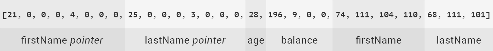

# Light Client for Exonum Blockchain

[![Build status][travis-image]][travis-url]
[![npm version][npmjs-image]][npmjs-url]
[![Coverage Status][coveralls-image]][coveralls-url]
[![js-standard-style][codestyle-image]][codestyle-url]

[travis-image]: https://img.shields.io/travis/exonum/exonum-client/master.svg
[travis-url]: https://travis-ci.org/exonum/exonum-client
[npmjs-image]: https://img.shields.io/npm/v/exonum-client.svg
[npmjs-url]: https://www.npmjs.com/package/exonum-client
[coveralls-image]: https://coveralls.io/repos/github/exonum/exonum-client/badge.svg?branch=master
[coveralls-url]: https://coveralls.io/github/exonum/exonum-client?branch=master
[codestyle-image]: https://img.shields.io/badge/code%20style-standard-brightgreen.svg
[codestyle-url]: http://standardjs.com

A JavaScript library to work with Exonum blockchain from browser and Node.js.
Used to sign transactions before sending to blockchain and verify blockchain responses using cryptographic proofs.
Contains numerous helper functions.

*Find out more information about the [architecture and tasks][docs:clients] of light clients in Exonum.*

* [Getting started](#getting-started)
* [Data types](#data-types)
  * [Define data type](#define-data-type)
  * [Built-in types](#built-in-types)
  * [Nested data types](#nested-data-types)
  * [Arrays](#arrays)
* [Serialization](#serialization)
* [Hash](#hash)
* [Signature](#signature)
  * [Sign data](#sign-data)
  * [Verify signature](#verify-signature)
* [Transactions](#transactions)
  * [Define transaction](#define-transaction)
  * [Sign transaction](#sign-transaction)
  * [Send transaction](#send-transaction)
  * [Send multiple transactions](#send-multiple-transactions)
* [Cryptographic proofs](#cryptographic-proofs)
  * [Merkle tree proof](#merkle-tree-proof)
  * [Map proof](#map-proof)
* [Integrity checks](#integrity-checks)
  * [Verify block](#verify-block)
* [Helpers](#helpers)
  * [Generate key pair](#generate-key-pair)
  * [Get random number](#get-random-number)
  * [Converters](#converters)
    * [Hexadecimal to Uint8Array](#hexadecimal-to-uint8array)
    * [Hexadecimal to String](#hexadecimal-to-string)
    * [Uint8Array to Hexadecimal](#uint8array-to-hexadecimal)
    * [Binary String to Uint8Array](#binary-string-to-uint8array)
    * [Binary String to Hexadecimal](#binary-string-to-hexadecimal)
    * [String to Uint8Array](#string-to-uint8array)
* [Contributing](#contributing)
  * [Coding standards](#coding-standards)
  * [Test coverage](#test-coverage)
* [Changelog](#changelog)
* [License](#license)

## Getting started

There are several options to include light client library in the application:

The most preferred way is to install Exonum Client as a [package][npmjs] from npm registry:

```sh
npm install exonum-client
```

Otherwise you can download the source code from GitHub and compile it before use in browser.

Include in browser:

```html
<script src="node_modules/exonum-client/dist/exonum-client.min.js"></script>
```

Usage in Node.js:

```javascript
let Exonum = require('exonum-client')
```

## Data types

The definition of data structures is the main part of each application based on Exonum blockchain.

On the one hand, each transaction must be [signed](#sign-data) before sending into blockchain.
Before the transaction is signed it is converted into byte array under the hood.

On the other hand, the data received from the blockchain should be converted into byte array under the hood
before it will be possible to [verify proof of its existence](#cryptographic-proofs) using cryptographic algorithm.

Converting data into a byte array is called [serialization](#serialization).
To get the same serialization result on the client and on the [service][docs:architecture:services] side,
there must be a strict serialization rules. This rules are formed by the data structure definition.

### Define data type

```javascript
let type = Exonum.newType({
  fields: [
    { name: 'balance', type: Exonum.Uint32 },
    { name: 'name', type: Exonum.String }
  ]
})
```

**Exonum.newType** function requires a single argument of `Object` type with next structure:

| Property | Description | Type |
|---|---|---|
| **fields** | List of fields. | `Array` |

Field structure:

| Field | Description | Type |
|---|---|---|
| **name** | Field name. | `String` |
| **type** | Definition of the field type. | [Built-in type](#built-in-types), [array](#arrays) or [custom data type](#nested-data-types) defined by the developer. |

### Built-in types

There are several primitive types are built it into the library.
These types must be used when constructing custom data types.

| Name | Description | Type |
|---|---|---|
| **Int8** | Number in a range from `-128` to `127`. | `Number` |
| **Int16** | Number in a range from `-32768` to `32767`. | `Number` |
| **Int32** | Number in a range from `-2147483648` to `2147483647`. | `Number` |
| **Int64** | Number in a range from `-9223372036854775808` to `9223372036854775807`. | `Number` or `String`\* |
| **Uint8** | Number in a range from `0` to `255`. | `Number` |
| **Uint16** | Number in a range from `0` to `65535`. | `Number` |
| **Uint32** | Number in a range from `0` to `4294967295`. | `Number` |
| **Uint64** | Number in a range from `0` to `18446744073709551615`. | `Number` or `String`\* |
| **Float32** | Floating point number in a range from `-3.40282347e+38f32` to `3.40282347e+38f32`. | `Number` or `String`\* |
| **Float64** | Floating point number in a range from `-1.7976931348623157e+308f64` to `1.7976931348623157e+308f64`. | `Number` or `String`\* |
| **String** | A string of variable length consisting of UTF-8 characters. | `String` |
| **Hash** | Hexadecimal string. | `String` |
| **PublicKey** | Hexadecimal string. | `String` |
| **Digest** | Hexadecimal string. | `String` |
| **Bool** | Value of boolean type. | `Boolean` |

*\*JavaScript limits minimum and maximum integer number.
Minimum safe integer in JavaScript is `-(2^53-1)` which is equal to `-9007199254740991`.
Maximum safe integer in JavaScript is `2^53-1` which is equal to `9007199254740991`.
For unsafe numbers out of the safe range use `String` only.
To determine either number is safe use built-in JavaScript function
[Number.isSafeInteger()][is-safe-integer].*

### Nested data types

Custom data type defined by the developer can be a field of other custom data type.

An example of a nested type:

```javascript
// Define a nested data type
let date = Exonum.newType({
  fields: [
    { name: 'day', type: Exonum.Uint8 },
    { name: 'month', type: Exonum.Uint8 },
    { name: 'year', type: Exonum.Uint16 }
  ]
})

// Define a data type
let payment = Exonum.newType({
  fields: [
    { name: 'date', type: date },
    { name: 'amount', type: Exonum.Uint64 }
  ]
})
```

There is no limitation on the depth of nested data types.

### Arrays

The array in the light client library corresponds to the [vector structure][vector-structure]
in the Rust language.

**Exonum.newArray** function requires a single argument of `Object` type with next structure:

| Property | Description | Type |
|---|---|---|
| **type** | Definition of the field type. | [Built-in type](#built-in-types), array or [custom data type](#nested-data-types) defined by the developer. |

An example of an array type field: 

```javascript
// Define an array
let year = Exonum.newArray({
  type: Exonum.Uint16
})

// Define a data type
let type = Exonum.newType({
  fields: [
    { name: 'years', type: year }
  ]
})
```

An example of an array nested in an array:

```javascript
// Define an array
let distance = Exonum.newArray({
  type: Exonum.Uint32
})

// Define an array with child elements of an array type
let distances = Exonum.newArray({
  type: distance
})

// Define a data type
let type = Exonum.newType({
  fields: [
    { name: 'measurements', type: distances }
  ]
})
```

## Serialization

Each serializable data type has its (de)serialization rules, which govern how the instances of this type are
(de)serialized from/to a binary buffer.
Check [serialization guide][docs:architecture:serialization] for details.

Signature of `serialize` function:

```javascript
type.serialize(data, cutSignature)
```

| Argument | Description | Type |
|---|---|---|
| **data** | Data to serialize. | `Object` |
| **type** | Definition of the field type. | [Custom data type](#define-data-type) or [transaction](#define-transaction). |
| **cutSignature** | This flag is relevant only for **transaction** type. Specifies whether to not include a signature into the resulting byte array. *Optional.* | `Boolean` |

An example of serialization into a byte array:

```javascript
// Define a data type
let user = Exonum.newType({
  fields: [
    { name: 'firstName', type: Exonum.String },
    { name: 'lastName', type: Exonum.String },
    { name: 'age', type: Exonum.Uint8 },
    { name: 'balance', type: Exonum.Uint32 }
  ]
})

// Data to be serialized
const data = {
  firstName: 'John',
  lastName: 'Doe',
  age: 28,
  balance: 2500
}


// Serialize
let buffer = user.serialize(data) // [21, 0, 0, 0, 4, 0, 0, 0, 25, 0, 0, 0, 3, 0, 0, 0, 28, 196, 9, 0, 0, 74, 111, 104, 110, 68, 111, 101]
```

The value of the `buffer` array:



## Hash

Exonum uses [cryptographic hashes][docs:glossary:hash] of certain data for [transactions](#transactions) and
[proofs](#cryptographic-proofs).

Different signatures of the `hash` function are possible:

```javascript
Exonum.hash(data, type)
```

```javascript
type.hash(data)
```

| Argument | Description | Type |
|---|---|---|
| **data** | Data to be processed using a hash function. | `Object` |
| **type** | Definition of the data type. | [Custom data type](#define-data-type) or [transaction](#define-transaction). |

An example of hash calculation:

```javascript
// Define a data type
let user = Exonum.newType({
  fields: [
    { name: 'firstName', type: Exonum.String },
    { name: 'lastName', type: Exonum.String },
    { name: 'age', type: Exonum.Uint8 },
    { name: 'balance', type: Exonum.Uint32 }
  ]
})

// Data that has been hashed
const data = {
  firstName: 'John',
  lastName: 'Doe',
  age: 28,
  balance: 2500
}

// Get a hash
let hash = user.hash(data) // 1e53d91704b4b6adcbea13d2f57f41cfbdee8f47225e99bb1ff25d85474185af
```

It is also possible to get a hash from byte array:

```javascript
Exonum.hash(buffer)
```

| Argument | Description | Type |
|---|---|---|
| **buffer** | Byte array. | `Array` or `Uint8Array`. |

An example of byte array hash calculation:

```javascript
const arr = [132, 0, 0, 5, 89, 64, 0, 7]

let hash = Exonum.hash(arr) // 9518aeb60d386ae4b4ecc64e1a464affc052e4c3950c58e32478c0caa9e414db
```

## Signature

The procedure for [**signing data**](#sign-data) using signing key pair
and [**verifying of obtained signature**](#verify-signature) is commonly used
in the process of data exchange between the client and the service.  

*Built-in [**Exonum.keyPair**](#generate-key-pair) helper function can be used
to generate a new random signing key pair.*

### Sign data

The signature can be obtained using the **secret key** of the signing pair.

There are three possible signatures of the `sign` function:

```javascript
Exonum.sign(secretKey, data, type)
```

```javascript
type.sign(secretKey, data)
```

```javascript
Exonum.sign(secretKey, buffer)
```

| Argument | Description | Type |
|---|---|---|
| **secretKey** | Secret key as hexadecimal string. | `String` |
| **data** | Data to be signed. | `Object` |
| **type** | Definition of the data type. | [Custom data type](#define-data-type) or [transaction](#define-transaction). |
| **buffer** | Byte array. | `Array` or `Uint8Array`. |

The `sign` function returns value as hexadecimal `String`.

An example of data signing:

```javascript
// Define a data type
let user = Exonum.newType({
  fields: [
    { name: 'firstName', type: Exonum.String },
    { name: 'lastName', type: Exonum.String },
    { name: 'age', type: Exonum.Uint8 },
    { name: 'balance', type: Exonum.Uint32 }
  ]
})

// Data to be signed
const data = {
  firstName: 'John',
  lastName: 'Doe',
  age: 28,
  balance: 2500
}

// Define a signing key pair
const keyPair = {
  publicKey: 'fa7f9ee43aff70c879f80fa7fd15955c18b98c72310b09e7818310325050cf7a',
  secretKey: '978e3321bd6331d56e5f4c2bdb95bf471e95a77a6839e68d4241e7b0932ebe2b' +
  'fa7f9ee43aff70c879f80fa7fd15955c18b98c72310b09e7818310325050cf7a'
}

// Sign the data
let signature = Exonum.sign(keyPair.secretKey, data, user)
```

### Verify signature

The signature can be verified using the **author's public key**.

There are two possible signatures of the `verifySignature` function:

```javascript
Exonum.verifySignature(signature, publicKey, data, type)
```

```javascript
type.verifySignature(signature, publicKey, data)
```

| Argument | Description | Type |
|---|---|---|
| **signature** | Signature as hexadecimal string. | `String` |
| **publicKey** | Public key as hexadecimal string. | `String` |
| **data** | Data that has been signed. | `Object` |
| **type** | Definition of the data type. | [Custom data type](#define-data-type) or [transaction](#define-transaction). |

The `verifySignature` function returns value of `Boolean` type.

An example of signature verification:

```javascript
// Define a data type
let user = Exonum.newType({
  fields: [
    { name: 'firstName', type: Exonum.String },
    { name: 'lastName', type: Exonum.String },
    { name: 'age', type: Exonum.Uint8 },
    { name: 'balance', type: Exonum.Uint32 }
  ]
})

// Data that has been signed
const data = {
  firstName: 'John',
  lastName: 'Doe',
  age: 28,
  balance: 2500
}

// Define a signing key pair
const keyPair = {
  publicKey: 'fa7f9ee43aff70c879f80fa7fd15955c18b98c72310b09e7818310325050cf7a',
  secretKey: '978e3321bd6331d56e5f4c2bdb95bf471e95a77a6839e68d4241e7b0932ebe2b' +
  'fa7f9ee43aff70c879f80fa7fd15955c18b98c72310b09e7818310325050cf7a'
}
const publicKey = 'fa7f9ee43aff70c879f80fa7fd15955c18b98c72310b09e7818310325050cf7a'
const secretKey = '978e3321bd6331d56e5f4c2bdb95bf471e95a77a6839e68d4241e7b0932ebe2b' +
 'fa7f9ee43aff70c879f80fa7fd15955c18b98c72310b09e7818310325050cf7a'

// Signature obtained upon signing using secret key
const signature = '41884c5270631510357bb37e6bcbc8da61603b4bdb05a2c70fc11d6624792e07' +
 'c99321f8cffac02bbf028398a4118801a2cf1750f5de84cc654f7bf0df71ec00'

// Verify the signature
let result = Exonum.verifySignature(signature, publicKey, data, user) // true
```

## Transactions

Transaction in Exonum is a operation to change the data stored in blockchain.
Transaction processing rules is a part of business logic implemented on [service][docs:architecture:services] side.

Sending data to the blockchain from a light client consist of 3 steps:

1) Describe the fields of transaction using [custom data types](#define-data-type);
2) [Sign](#sign-data) data of transaction using signing key pair;
3) [Send transaction](#send-single-transaction) to the blockchain.
 
Read more about [transactions][docs:architecture:transactions] in Exonum.

### Define transaction

An example of a transaction definition:

```javascript
let sendFunds = Exonum.newMessage({
  protocol_version: 0,
  service_id: 130,
  message_id: 128,
  fields: [
    { name: 'from', type: Exonum.Hash },
    { name: 'to', type: Exonum.Hash },
    { name: 'amount', type: Exonum.Uint64 }
  ]
})
```

**Exonum.newMessage** function requires a single argument of `Object` type with next structure:

| Property | Description | Type |
|---|---|---|
| **protocol_version** | [Protocol version][docs:architecture:serialization:protocol-version]. | `Number` |
| **service_id** | [Service ID][docs:architecture:serialization:service-id]. | `Number` |
| **message_id** | [Message ID][docs:architecture:serialization:message-id]. | `Number` |
| **signature** | Signature as hexadecimal string. *Optional.* | `String` |
| **fields** | List of fields. | `Array` |

Field structure is identical to field structure of [custom data type](#define-data-type).

### Sign transaction

An example of a transaction signing:

```javascript
// Signing key pair
const keyPair = {
  publicKey: 'fa7f9ee43aff70c879f80fa7fd15955c18b98c72310b09e7818310325050cf7a',
  secretKey: '978e3321bd6331d56e5f4c2bdb95bf471e95a77a6839e68d4241e7b0932ebe2b' +
  'fa7f9ee43aff70c879f80fa7fd15955c18b98c72310b09e7818310325050cf7a'
}

// Transaction data to be signed
const data = {
  from: 'fa7f9ee43aff70c879f80fa7fd15955c18b98c72310b09e7818310325050cf7a',
  to: 'f7ea8fd02cb41cc2cd45fd5adc89ca1bf605b2e31f796a3417ddbcd4a3634647',
  amount: 1000
}

// Sign the data
let signature = sendFunds.sign(keyPair.secretKey, data)
```

### Send transaction

To submit transaction to the blockchain `send` function can be used.

There are two possible signatures of the `send` function:

```javascript
Exonum.send(transactionEndpoint, explorerBasePath, data, signature, sendFunds)

sendFunds.send(transactionEndpoint, explorerBasePath, data, signature)
```

| Property | Description | Type |
|---|---|---|
| **transactionEndpoint** | API address of transaction handler on a blockchain node. | `String` |
| **explorerBasePath** | API address of transaction explorer on a blockchain node. | `String` |
| **data** | Data that has been signed. | `Object` |
| **signature** | Signature as hexadecimal string. | `String` |
| **type** | Definition of the transaction. | [Transaction](#define-transaction). |

The `send` function returns value of `Promise` type.
Fulfilled state means that transaction is accepted to the block.
Fulfilled value contained transaction with its proof.

An example of a transaction sending:

```javascript
// Define transaction handler address
const transactionEndpoint = 'http://127.0.0.1:8200/api/services/cryptocurrency/v1/wallets'

// Define transaction explorer address
const explorerBasePath = 'http://127.0.0.1:8200/api/explorer/v1/transactions/'

sendFunds.send(transactionEndpoint, explorerBasePath, data, signature)
```

### Send multiple transactions

To submit multiple transactions to the blockchain `sendQueue` function can be used.
Transactions will be stored in the appropriate order.
Each transaction from the queue will be sent to the blockchain only after the previous transaction is accepted to the block.

```javascript
Exonum.sendQueue(transactionEndpoint, explorerBasePath, transactions)
```

| Property | Description | Type |
|---|---|---|
| **transactionEndpoint** | API address of transaction handler on a blockchain node. | `String` |
| **explorerBasePath** | API address of transaction explorer on a blockchain node. | `String` |
| **transactions** | List of transactions. | `Array` |

Transaction structure:

| Field | Description | Type |
|---|---|---|
| **data** | Transaction data that has been signed. | `Object` |
| **signature** | Signature as hexadecimal string. | `String` |
| **type** | Definition of the transaction. | [Transaction](#define-transaction). |

The `sendQueue` function returns value of `Promise` type.
Fulfilled state means that all transactions are accepted to the block.
Fulfilled value contained an array of transactions with its proofs.

Find more examples of operations on transactions:

* [Define transaction](examples/transactions.md#define-transaction)
* [Serialize transaction](examples/transactions.md#serialize-transaction)
* [Sign transaction](examples/transactions.md#sign-transaction)
* [Verify signed transaction](examples/transactions.md#verify-signed-transaction)
* [Get a transaction hash](examples/transactions.md#get-a-transaction-hash)
* [Send transaction](examples/transactions.md#send-transaction)
* [Send multiple transactions](examples/transactions.md#send-multiple-transaction)

## Cryptographic proofs

A cryptographic proof is a format in which a Exonum node can provide sensitive data from a blockchain.
These proofs are based on [Merkle trees][docs:glossary:merkle-tree] and their variants.

Light client library validates the cryptographic proof and can prove the integrity and reliability of the received data.

Read more about design of [cryptographic proofs][docs:advanced:merkelized-list] in Exonum.

### Merkle tree proof

```javascript
let elements = Exonum.merkleProof(rootHash, count, tree, range, type)
```

The `merkleProof` method is used to validate the Merkle tree and extract a **list of data elements**.

| Argument | Description | Type |
|---|---|---|
| **rootHash** | The root hash of the Merkle tree as hexadecimal string. | `String` |
| **count** | The total number of elements in the Merkle tree. | `Number` |
| **proofNode** | The Merkle tree. | `Object` |
| **range** | An array of two elements of `Number` type. Represents list of obtained elements: `[startIndex; endIndex)`. | `Array` |
| **type** | Definition of the elements type. *Optional. The `merkleProof` method expects to find byte arrays as values in the tree if `type` is not passed.* | [Custom data type](#define-data-type) |

An [example of verifying a Merkle tree](examples/merkle-tree.md).

### Map proof

```javascript
let proof = new Exonum.MapProof(json, KeyType, ValueType)
console.log(proof.entries)
```

The `MapProof` class is used to validate proofs for Merkelized maps.

| Argument | Description | Type |
|---|---|---|
| **json** | The JSON presentation of the proof obtained from a full node. | `Object` |
| **KeyType** | Data type for keys in the Merkelized map. | [Custom](#define-data-type) or built-in data type |
| **ValueType** | Data type for values in the Merkelized map. | [Custom data type](#define-data-type) |

The returned object has the following fields:

| Field | Description | Type |
|---|---|---|
| **merkleRoot** | Hexadecimal hash of the root of the underlying Merkelized map | `String` |
| **missingKeys** | Set of keys which the proof asserts as missing from the map | `Set<KeyType>` |
| **entries** | Map of key-value pairs that the are proved to exist in the map | `Map<KeyType, ValueType>` |

An [example of using a `MapProof`](examples/map-proof.js).

## Integrity checks

### Verify block

```javascript
Exonum.verifyBlock(data, validators)
```

Each new block in Exonum blockchain is signed by [validators][docs:glossary:validator].
To prove the integrity and reliability of the block, it is necessary to verify their signatures.
The signature of each validator are stored in the precommits.

The `merkleProof` method is used to validate block and its precommits.

Returns `true` if verification is succeeded or `false` if it is failed.

| Argument | Description | Type |
|---|---|---|
| **data** | Structure with block and precommits. | `Object` |
| **validators** | An array of validators public keys as a hexadecimal strings. | `Array` |

An example of [block verification](examples/block.md).

## Helpers

### Generate key pair

```javascript
const pair = Exonum.keyPair()
```

```javascript
{
  publicKey: "...", // 32-byte public key
  secretKey: "..." // 64-byte secret key
}
```

**Exonum.keyPair** function generates a new random [Ed25519][docs:glossary:digital-signature] signing key pair using the
[TweetNaCl][tweetnacl:key-pair] cryptographic library.

### Get random number

```javascript
const rand = Exonum.randomUint64()
``` 

**Exonum.randomUint64** function generates a new random `Uint64` number of cryptographic quality using the
[TweetNaCl][tweetnacl:random-bytes] cryptographic library.

### Converters

#### Hexadecimal to Uint8Array

```javascript
const hex = '674718178bd97d3ac5953d0d8e5649ea373c4d98b3b61befd5699800eaa8513b'

Exonum.hexadecimalToUint8Array(hex) // [103, 71, 24, 23, 139, 217, 125, 58, 197, 149, 61, 13, 142, 86, 73, 234, 55, 60, 77, 152, 179, 182, 27, 239, 213, 105, 152, 0, 234, 168, 81, 59]
```

#### Hexadecimal to String

```javascript
const hex = '674718178bd97d3ac5953d0d8e5649ea373c4d98b3b61befd5699800eaa8513b'

Exonum.hexadecimalToBinaryString(hex) // '0110011101000111000110000001011110001011110110010111110100111010110001011001010100111101000011011000111001010110010010011110101000110111001111000100110110011000101100111011011000011011111011111101010101101001100110000000000011101010101010000101000100111011'
```

#### Uint8Array to Hexadecimal

```javascript
const arr = new Uint8Array([103, 71, 24, 23, 139, 217, 125, 58, 197, 149, 61, 13, 142, 86, 73, 234, 55, 60, 77, 152, 179, 182, 27, 239, 213, 105, 152, 0, 234, 168, 81, 59])

Exonum.uint8ArrayToHexadecimal(arr) // '674718178bd97d3ac5953d0d8e5649ea373c4d98b3b61befd5699800eaa8513b'
```

#### Uint8Array to BinaryString

```javascript
const arr = new Uint8Array([103, 71, 24, 23, 139, 217, 125, 58, 197, 149, 61, 13, 142, 86, 73, 234, 55, 60, 77, 152, 179, 182, 27, 239, 213, 105, 152, 0, 234, 168, 81, 59])

Exonum.uint8ArrayToBinaryString(arr) // '0110011101000111000110000001011110001011110110010111110100111010110001011001010100111101000011011000111001010110010010011110101000110111001111000100110110011000101100111011011000011011111011111101010101101001100110000000000011101010101010000101000100111011'
```

#### Binary String to Uint8Array

```javascript
const str = '0110011101000111000110000001011110001011110110010111110100111010110001011001010100111101000011011000111001010110010010011110101000110111001111000100110110011000101100111011011000011011111011111101010101101001100110000000000011101010101010000101000100111011'

Exonum.binaryStringToUint8Array(str) // [103, 71, 24, 23, 139, 217, 125, 58, 197, 149, 61, 13, 142, 86, 73, 234, 55, 60, 77, 152, 179, 182, 27, 239, 213, 105, 152, 0, 234, 168, 81, 59]
```

#### Binary String to Hexadecimal

```javascript
const str = '0110011101000111000110000001011110001011110110010111110100111010110001011001010100111101000011011000111001010110010010011110101000110111001111000100110110011000101100111011011000011011111011111101010101101001100110000000000011101010101010000101000100111011'

Exonum.binaryStringToHexadecimal(str) // '674718178bd97d3ac5953d0d8e5649ea373c4d98b3b61befd5699800eaa8513b'
```

#### String to Uint8Array

```javascript
const str = 'Hello world'

Exonum.stringToUint8Array(str) // [72, 101, 108, 108, 111, 32, 119, 111, 114, 108, 100]
```

## Contributing

The contributing to the Exonum Client is based on the same principles and rules as
[the contributing to exonum-core][contributing].

### Coding standards

The coding standards are described in the [`.eslintrc`](.eslintrc.json) file.

To help developers define and maintain consistent coding styles between different editors and IDEs
we used [`.editorconfig`](.editorconfig) configuration file.

### Test coverage

All functions must include relevant unit tests.
This applies to both of adding new features and fixing existed bugs.

## Changelog

Detailed changes for each release are documented in the [CHANGELOG](CHANGELOG.md) file.
Use it to check compatibility with Exonum core.

## License

Exonum Client is licensed under the Apache License (Version 2.0). See [LICENSE](LICENSE) for details.

[docs:clients]: https://exonum.com/doc/architecture/clients
[docs:architecture:services]: https://exonum.com/doc/architecture/services
[docs:architecture:serialization]: https://exonum.com/doc/architecture/serialization
[docs:architecture:serialization:network-id]: https://exonum.com/doc/architecture/serialization/#etwork-id
[docs:architecture:serialization:protocol-version]: https://exonum.com/doc/architecture/serialization/#protocol-version
[docs:architecture:serialization:service-id]: https://exonum.com/doc/architecture/serialization/#service-id
[docs:architecture:serialization:message-id]: https://exonum.com/doc/architecture/serialization/#message-id
[docs:architecture:transactions]: https://exonum.com/doc/architecture/transactions
[docs:advanced:merkelized-list]: https://exonum.com/doc/advanced/merkelized-list
[docs:glossary:digital-signature]: https://exonum.com/doc/glossary/#digital-signature
[docs:glossary:hash]: https://exonum.com/doc/glossary/#hash
[docs:glossary:blockchain-state]: https://exonum.com/doc/glossary/#blockchain-state
[docs:glossary:merkle-tree]: https://exonum.com/doc/glossary/#merkle-tree
[docs:glossary:validator]: https://exonum.com/doc/glossary/#validator
[npmjs]: https://www.npmjs.com/package/exonum-client
[gitter]: https://gitter.im/exonum/exonum
[twitter]: https://twitter.com/ExonumPlatform
[newsletter]: https://exonum.com/#newsletter
[contributing]: https://exonum.com/doc/contributing/
[is-safe-integer]: https://developer.mozilla.org/en-US/docs/Web/JavaScript/Reference/Global_Objects/Number/isSafeInteger
[vector-structure]: https://doc.rust-lang.org/std/vec/struct.Vec.html
[tweetnacl:key-pair]: https://github.com/dchest/tweetnacl-js#naclsignkeypair
[tweetnacl:random-bytes]: https://github.com/dchest/tweetnacl-js#random-bytes-generation
